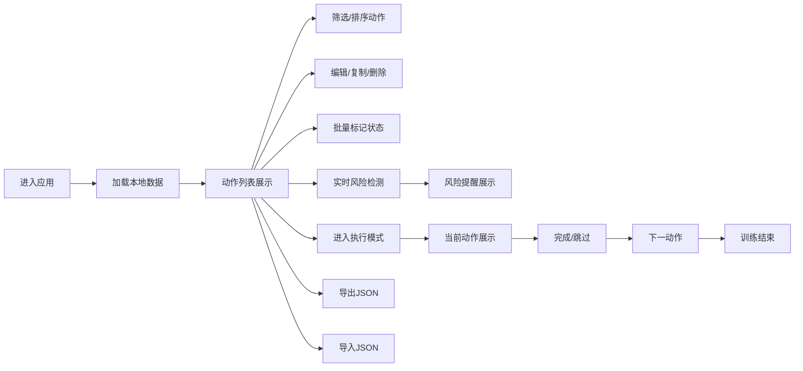

## 1. 产品概述

训练动作规划单页应用，用于个人训练前规划动作顺序、实时计算训练时长、检测训练风险。目标用户为健身爱好者、力量训练者，帮助他们科学规划训练，避免训练风险。

## 2. 核心功能

### 2.1 功能模块

1. **动作管理**：动作列表展示、动作编辑、动作复制、动作删除
2. **筛选排序**：按目标部位、器械、强度、状态、时长区间筛选，拖拽调整训练顺序
3. **批量操作**：批量标记"待训练""已完成""需降强度""跳过"
4. **风险提醒**：同部位连续高强度、注意事项缺失、总时长超出计划、组数或次数为零、跳过后仍计入时长等问题检测
5. **数据持久化**：localStorage 本地存储、JSON 导入导出
6. **训练执行模式**：按顺序展示当前动作、下一动作和剩余时长，快速切换完成或跳过

### 2.2 动作数据结构

| 字段 | 说明 |
|------|------|
| 动作名 | 动作名称 |
| 目标部位 | 胸部、背部、肩部、手臂、核心、腿部、臀部等 |
| 器械 | 哑铃、杠铃、器械、自重、弹力带等 |
| 组数 | 训练组数 |
| 次数 | 每组次数 |
| 强度 | 低强度、中强度、高强度 |
| 预计时长 | 单组预计时长（分钟） |
| 注意事项 | 动作注意事项描述 |
| 状态 | 待训练、已完成、需降强度、跳过 |

## 3. 核心流程

### 3.1 用户主流程

用户进入应用 → 浏览/添加训练动作 → 筛选和排序动作 → 调整组数次数 → 查看风险提醒 → 进入训练执行模式 → 完成训练

### 3.2 流程图

## 4. 用户界面设计

### 4.1 设计风格

- **主色调**：深邃炭灰背景 + 活力橙强调色，专业健身风格
- **辅助色**：绿色（正常）、黄色（警告）、红色（危险）
- **字体**：现代无衬线字体，数字使用等宽字体
- **风格**：卡片式布局、硬朗线条、运动感、深色模式
- **图标**：使用 lucide-react 线性图标

### 4.2 页面布局

| 区域 | 说明 |
|------|------|
| 顶部栏 | 应用标题、总时长统计、执行模式切换、导入导出按钮 |
| 左侧筛选区 | 多维度筛选器（部位、器械、强度、状态、时长区间） |
| 主内容区 | 动作列表卡片，支持拖拽排序、批量选择 |
| 底部风险栏 | 风险提醒汇总，可展开查看详情 |

### 4.3 训练执行模式

- 全屏深色模式，大字展示当前动作
- 当前动作详情卡片
- 下一动作预览
- 剩余总时长倒计时
- 快速操作按钮（完成、跳过、需降强度）

### 4.4 响应式设计

- 桌面端：左右分栏布局
- 平板端：筛选区折叠为顶部筛选条
- 移动端：单列布局，底部导航切换视图
