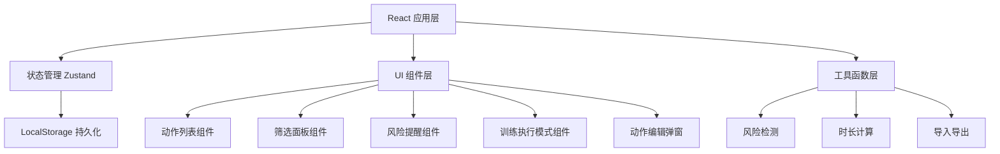

## 1. 架构设计



## 2. 技术描述

- **前端框架**：React@18 + TypeScript
- **构建工具**：Vite@5
- **状态管理**：Zustand
- **样式方案**：Tailwind CSS@3
- **拖拽库**：@dnd-kit/core + @dnd-kit/sortable
- **图标库**：lucide-react
- **数据持久化**：localStorage

## 3. 目录结构

```
src/
├── components/
│   ├── ActionCard.tsx        # 动作卡片组件
│   ├── ActionForm.tsx        # 动作编辑表单
│   ├── ActionList.tsx        # 动作列表
│   ├── FilterPanel.tsx       # 筛选面板
│   ├── RiskAlert.tsx         # 风险提醒
│   ├── ExecutionMode.tsx     # 训练执行模式
│   ├── Header.tsx            # 顶部导航
│   └── BatchToolbar.tsx      # 批量操作工具栏
├── store/
│   └── useWorkoutStore.ts    # Zustand状态管理
├── types/
│   └── index.ts              # TypeScript类型定义
├── utils/
│   ├── riskDetection.ts      # 风险检测工具
│   ├── storage.ts            # localStorage工具
│   └── timeCalculator.ts     # 时长计算工具
├── data/
│   └── defaultActions.ts     # 默认动作数据
├── App.tsx                   # 主应用组件
├── main.tsx                  # 入口文件
└── index.css                 # 全局样式
```

## 4. 数据模型

### 4.1 动作数据模型

```typescript
interface WorkoutAction {
  id: string;
  name: string;
  targetMuscle: string;
  equipment: string;
  sets: number;
  reps: number;
  intensity: 'low' | 'medium' | 'high';
  duration: number;
  notes: string;
  status: 'pending' | 'completed' | 'reduce' | 'skip';
  order: number;
}
```

### 4.2 筛选条件

```typescript
interface FilterOptions {
  targetMuscle: string[];
  equipment: string[];
  intensity: string[];
  status: string[];
  durationMin: number | null;
  durationMax: number | null;
}
```

### 4.3 风险检测结果

```typescript
interface RiskItem {
  id: string;
  type: 'warning' | 'error';
  message: string;
  actionIds?: string[];
}
```

## 5. 状态管理设计

### 5.1 Store 状态

- `actions: WorkoutAction[]` - 动作列表
- `selectedIds: string[]` - 选中的动作ID
- `filters: FilterOptions` - 筛选条件
- `plannedDuration: number` - 计划总时长
- `isExecutionMode: boolean` - 是否处于执行模式
- `currentActionIndex: number` - 当前动作索引

### 5.2 Store 操作

- `addAction` - 添加动作
- `updateAction` - 更新动作
- `deleteAction` - 删除动作
- `duplicateAction` - 复制动作
- `reorderActions` - 重新排序
- `batchUpdateStatus` - 批量更新状态
- `toggleSelect` - 切换选中
- `setFilters` - 设置筛选条件
- `exportJSON` - 导出JSON
- `importJSON` - 导入JSON
